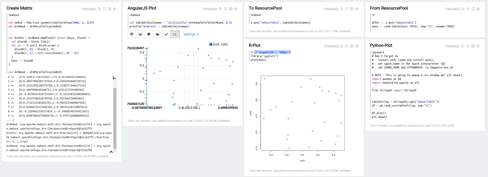



## Mahout Interpreter

Apache Mahout-Samsara is a machine learning library that exposes an R-Like Scala domain specific language (DSL) and a number of methods for working with and doing linear algebra on distributed matrices. Further, this is done in a 'backend agnostic' manner with a mentality of 'write it once, run it on anything'.

Apache Mahout-Samsara focuses exposing the user to mathematical tools for creating their own models, as opposed to a tool box of pre-built "Big Data" machine learning algorithms.  This is a philosophical shift from other machine learning libraries such as MLib or FlinkML.  

While the lack of out-of-the-box algorithms may be a turn off for many, users with a richer background in linear algebra will find Apache Mahout a refreshing return working directly with matrices and vectors that they likely haven't experienced since leaving single-core R and Python environments.

Further, Apache Mahout strives to be *backend agnostic*, which means even though this Mahout interpreter is backed by Apache Spark, one could run the same code on a Mahout system with an Apache Flink or H20 backend.

### Requirements

Apache Mahout 0.12.2+ is officially supported, however 0.12.1 will work with some limitations, and older versions may work as well.

Information for installing and configuring Apache Mahout can be found on the [project website](https://mahout.apache.org/developers/buildingmahout.html), or by following one of the several blogs on the subject.

### Configuration

Apache Mahout is a *back end agnostic* platform that may run on Apache Spark, Apache Flink, or H20.  At this time the only back end supported by Zeppelin is the Spark back end. As such, the `%mahout` interpreter is actually a `%mahout.spark` interpreter.  Configuration for each interpreter will generally include standard configurations for each back end, in addition to some back end settings that have been done specifically for Apache Mahout, and some Apache Mahout specific settings.

#### Spark Mahout

Most of the interpreter settings available for the `%mahout.spark` or `%mahout` interpreter are passed directly through the the Spark Interpreter, and the should see the appropriate Spark documentation for their setting.

In addition to the standard Apache Spark settings, the following settings are introduced:

`mahout.home` - This may either be set to
- `local`: in this case the `ZeppelinDependencyResolver` internally handles loading the proper JARs from Maven. This will be the method of choice for most users, who don't already have Apache Mahout installed, and no intention of running against a custom build.
- `/path/to/mahout/home` : in this case, the path to a local installation of Apache Mahout. This allows the user to run against an already existing Apache Mahout installation or a custom build.

`mahout.version` - If `mathout.home` is set to local, this setting allows the user to select which version of Apache Mahout to use.  It should be noted that the Apache Mahout+Apache Zeppelin integration is only supported for Apache Mahout version 0.12.1+, and requires Spark 1.5+. **NOTE**: If `mahout.home` is set to a locally installed version of Apache Mahout, then that version will be used and `mahout.version` setting will be ignored.

`spark.serializer`, `spark.kryoserializer.buffer`, `spark.kryo.registrator` `spark.kryo.referenceTracking` - These are Apache Spark configuration settings, and the user is directed to the Apache Spark documentation to understand their meaning, however it is not advised that any of these settings be altered *EXCEPT* for `spark.kryoserializer.buffer` which some users have reported a better experience when setting this to as high as `1g` on a system which can handle it.

### Using the Spark Mahout Interpreter

When `spark.mahout` is **true**, the `%spark` interpreter uses Apache Mahout's R-like domain specific language (DSL)
- [in-core reference](https://mahout.apache.org/users/environment/in-core-reference.html)
- [distributed linear algebra reference](https://mahout.apache.org/users/environment/out-of-core-reference.html)

Tutorials on using Apache Mahout
- [Ordinary Least Squares](https://mahout.apache.org/users/sparkbindings/play-with-shell.html)
- [Text Classifier](https://mahout.apache.org/users/environment/classify-a-doc-from-the-shell.html)

**NOTE**: There is no need to import mahout packages or create the SparkDistributedContext as shown in the examples.  When `spark.mahout` is **true** these are taken care of by Zeppelin.

### Leveraging SparkR for Visualizing Mahout Matrices

One of the most exciting use-cases of Apache Mahout+Apache Zeppelin is leveraging the existing visualization libraries of other programs such as `ggplot2` of the R-Statistical package or `matplotlib` of Python.  This is done by sampling a matrix from Apache Mahout, sending it to the Apache Zeppelin `ResourcePool`, where it is retrieved and read as a table by R/Python and plotted accordingly.

To utilize this functionality Apache Zeppelin must be built with R and/or Python support (e.g. using `-Psparkr` or `-Ppyspark` when building).

